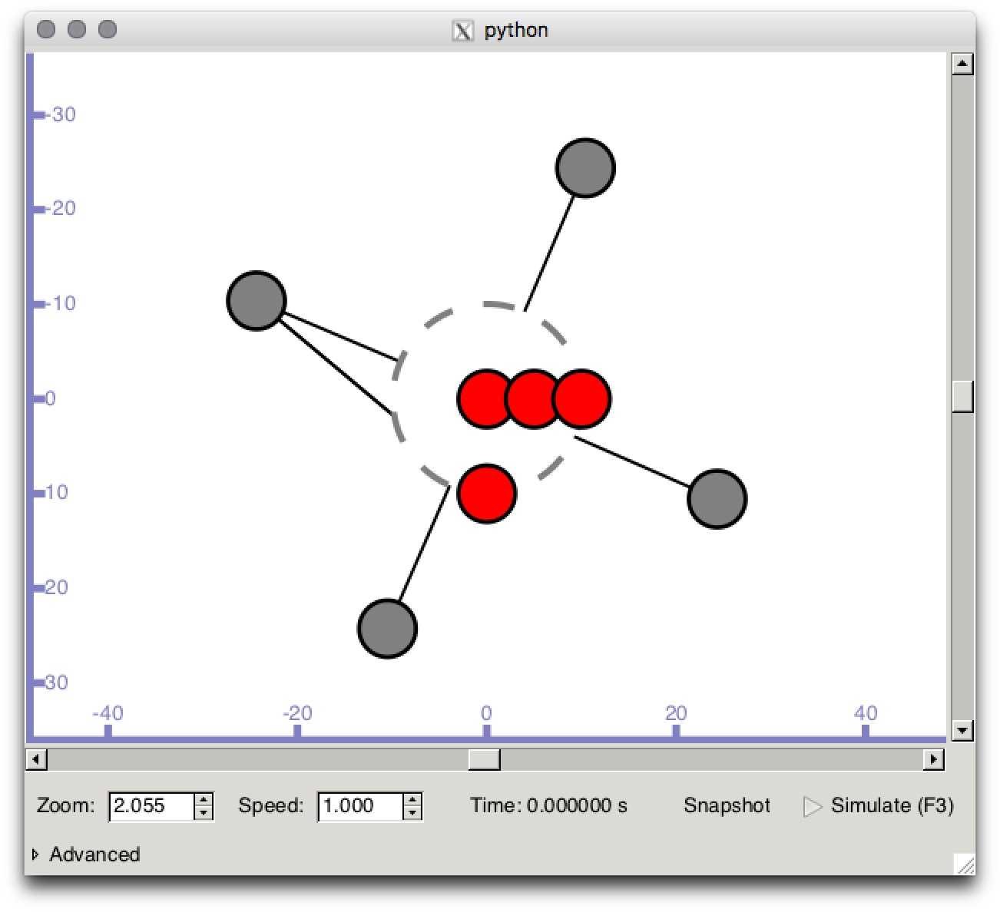

# การเรียก CallBack
ตัวอย่าง [third.cc](src/third.cc)
## คำสั่ง run simulator
```bash
./waf --run third --vis
```



```c++

// Default Network Topology
//
//   Wifi 10.1.3.0
//                 AP
//  *    *    *    *
//  |    |    |    |    10.1.1.0
// n5   n6   n7   n0 -------------- n1   n2   n3   n4
//                   point-to-point  |    |    |    |
//                                   ================
//                                     LAN 10.1.2.0
```

เมื่อแสดงผลบน GUI หมายเลขโหนดถูกเรียงตามลำดับการ Create จากภาพมีโหนดทั้งหมด 8 โหนด เป็น p2pNodes(2), csmaNodes(3) และ wifiStaNodes(3)

```c++
songrit$ grep -n "Nodes.Create" third.cc
73:  p2pNodes.Create (2);
84:  csmaNodes.Create (nCsma);
94:  wifiStaNodes.Create (nWifi);
```
เมื่อ

```c++
50: uint32_t nCsma = 3;
51: uint32_t nWifi = 3;
```

สีแดงใช้แทน wifi โหนด สีเทาใช้แทน csma โหนด

จาก GUI  `n0` และ `n1` เทียบเป็น `p2pNodes` เรียงลำดับเลขตามคำสั่งCreate โหนดกลุ่มต่อมาเป็นโหนดชนิด csmaNodes จำนวน `nCsma=3` ดังนั้น `n2`,`n3`,`n4` เป็น `csmaNodes` สุดท้าย `wifiStaNodes` จำนวน `nWifi=3` ทำให้ `n5` `n6` `n7` เป็นโหนดชนิด `wifiStaNodes`

โค๊ดบรรทัดที่ [#L155-L169](https://github.com/NS3CO/tutorial/blob/master/code/third.cc#L155-L169) ติดตั้ง `echoServer` บน `csmaNodes` โหนดที่ 3 หมายถึงติดตั้งที่ `n4` และติดตั้ง `echoClient` บน `wifiStaNodes` โหนดที่ (`nWifi - 1`) สร้างโหนดจำนวน 3โหนดอ้างอิง wifiStaNodes[0],wifiStaNodes[1],wifiStaNodes[2] เมื่อ `nWifi-1` หมายถึง wifiStaNodes[2] หรือติดตั้งที่ `n7`

โค๊ด [#L167](https://github.com/NS3CO/tutorial/blob/master/code/third.cc#L167) กำหนดให้ `wifiStaNodes.Get (nWifi - 1)` ส่ง echo request ไป `csmaNodes.Get (nCsma)` [#L161](https://github.com/NS3CO/tutorial/blob/master/code/third.cc#L161) จำนวน 1 เฟรม(`MaxPackets=1`)[#L162](https://github.com/NS3CO/tutorial/blob/master/code/third.cc#L162) เริ่มต้นวินาทีที่2 สิ้นสุดวินาทีที่ 10 รวม 8วินาที และจบการจำนวนในวินาทีที่10

เส้นทางข้อมูลดูได้จาก `// Default Network Topology` n7->n0->n1->n4

# Resources
* [The list of all trace sources : https://www.nsnam.org/doxygen/_trace_source_list.html](https://www.nsnam.org/doxygen/_trace_source_list.html)
*
